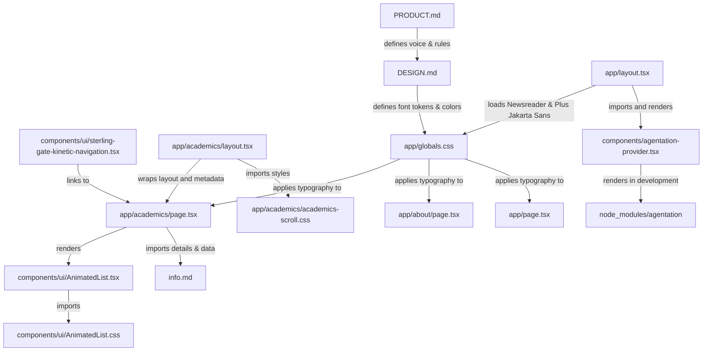

# Graph Report - Academics Page Flow & Typography Integration

This report documents the architectural structure, dependencies, and design systems of the newly integrated Academics section, typography redesign, and subsequent layout refinements.

## File Relationship Graph

## Component and Route Descriptions

### 1. Route: `/academics`
*   **Layout** ([app/academics/layout.tsx](file:///c:/Users/phani/Desktop/College-Web-Redesign/app/academics/layout.tsx)): Contains page title and meta description metadata optimized for SEO. Imports `academics-scroll.css`.
*   **Syllabus Styles** ([app/academics/academics-scroll.css](file:///c:/Users/phani/Desktop/College-Web-Redesign/app/academics/academics-scroll.css)): Implements the responsive pinned mask reveal styling for desktop and mobile layouts.
*   **Page** ([app/academics/page.tsx](file:///c:/Users/phani/Desktop/College-Web-Redesign/app/academics/page.tsx)): Fully responsive layout featuring the five key academic sections:
    *   *Hero*: Intro banner featuring GSAP-powered line-reveal animations (`SplitType`), a background horizontal scroll parallax ticker, and dual criss-crossing infinite scrolling marquees (spanning full-screen width with solid black backdrops instead of glassmorphism) replacing the static description text.
    *   *Programs & Departments*: CME, ECE, EEE, and Basic Sciences sections integrated with a GSAP-pinned mask reveal parallax layout.
    *   *Syllabus & Calendar*: Cards styled with skeuomorphic depress effects, linking to syllabus downloads and calendar PDFs.
    *   *Examinations & Results*: Two-column overview of the Examination Cell and direct results portal redirection.
    *   *Academic Excellence*: Centered 25+ Years Legacy card launcher triggers the topper list explorer. The redundant featured topper card was removed.
    *   *Student Development*: Staggered tab animations showcasing clubs, workshops, guest lectures, and student achievements.

### 2. Component: `AnimatedList`
*   **Source** ([components/ui/AnimatedList.tsx](file:///c:/Users/phani/Desktop/College-Web-Redesign/components/ui/AnimatedList.tsx)): Translated React Bits scrolling selector with keyboard arrow-key navigation, in-view staggers, and selection callbacks. Fixed type error by changing `triggerOnce: false` to `once: false` inside the `useInView` hook.
*   **Styling** ([components/ui/AnimatedList.css](file:///c:/Users/phani/Desktop/College-Web-Redesign/components/ui/AnimatedList.css)): Dark-mode scrollbars, neon emerald list indicators, and selection animations.

### 3. Layout & Layout Polish Refinements
*   **About Page** ([app/about/page.tsx](file:///c:/Users/phani/Desktop/College-Web-Redesign/app/about/page.tsx)): Removed the "Institution Identity" and "Structural Integrity" badge pills to streamline layout.
*   **Home Page** ([app/page.tsx](file:///c:/Users/phani/Desktop/College-Web-Redesign/app/page.tsx)): Added an SBSP logo and branding header positioned at the top-left of the page viewport/hero section, balanced against the top-right header menu controls.
*   **Navigation & Branding Overlay** ([components/ui/sterling-gate-kinetic-navigation.tsx](file:///c:/Users/phani/Desktop/College-Web-Redesign/components/ui/sterling-gate-kinetic-navigation.tsx)): Added a branding section containing the SBSP Logo, Title, and Subtitle to the fullscreen overlay sidebar, and incorporated a dedicated Close button inside the sliding panel wrapper. The entire header row (branding + close button) is wrapped in an `overflow-hidden` container and animated to slide up and reveal as a single kinetic entity in sync with the menu items when opened.
*   **Sticky Footer** ([components/ui/sticky-footer.tsx](file:///c:/Users/phani/Desktop/College-Web-Redesign/components/ui/sticky-footer.tsx)): Restructured campus links to balance page density. "Green Meadows Campus" spans 2 columns in a grid format, and Orchard Park & other campuses are consolidated, eliminating empty vertical columns on desktop viewports.
*   **Autoplay Testimonials** ([components/ui/circular-testimonials.tsx](file:///c:/Users/phani/Desktop/College-Web-Redesign/components/ui/circular-testimonials.tsx)): Configured an `IntersectionObserver` to pause auto-rotation until the testimonials section enters the viewport, ensuring that the Founder and Chairman slides are visible first upon scroll.
*   **Brand Nomenclature Cleanup**: Removed all legacy references to "Sri Vasavi" from global configs, system descriptors (`PRODUCT.md`, `DESIGN.md`), and main app layout headers (`app/layout.tsx`), replacing them strictly with "Smt. B. Seetha Polytechnic" (or "SBSP" in short form).

### 4. GSAP Percentage Preloader & Blinds Transition
*   **Global Effects** ([components/global-effects.tsx](file:///c:/Users/phani/Desktop/College-Web-Redesign/components/global-effects.tsx)): Replaced the deprecated Framer Motion preloader with a GSAP-driven loading timeline (0-100% percentage count and progress bar), vertical blinds reveal (5 panels on desktop, 3 on mobile), and a slide-up content entrance animation. Included session-storage persistence to prevent preloader execution on subsequent navigations.
*   **Loading Demo** ([app/loading-demo/page.tsx](file:///c:/Users/phani/Desktop/College-Web-Redesign/app/loading-demo/page.tsx)): Replaced with an interactive test-bed where the preloader session storage flag can be cleared and re-run.
*   **Housekeeping**: Deleted the deprecated `components/ui/kinetic-dots-loader.tsx` component.
