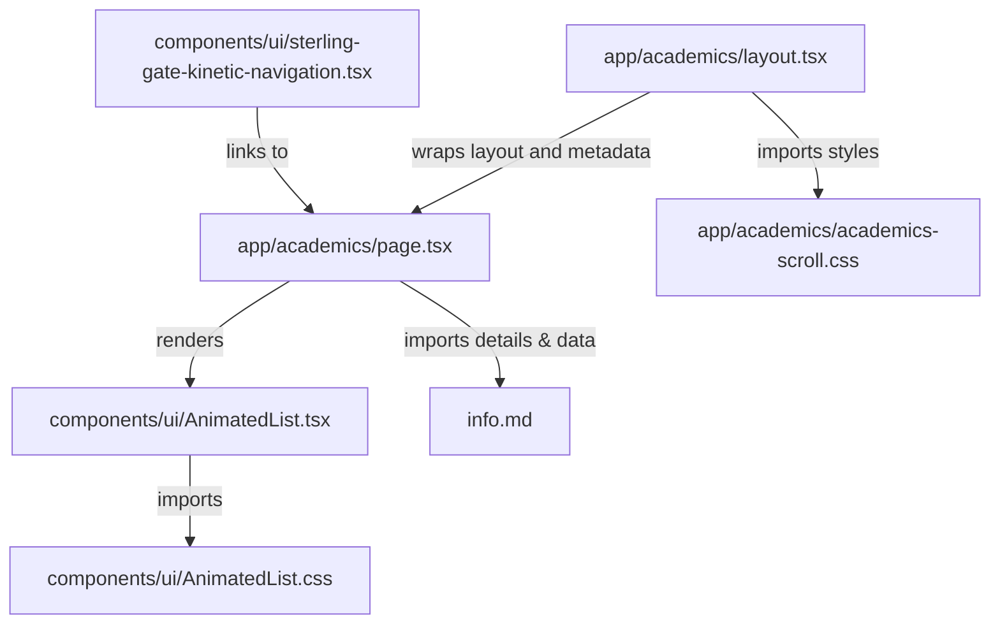

# Graph Report - Academics Page Flow Integration

This report documents the architectural structure and dependencies of the newly integrated Academics section.

## File Relationship Graph

## Component and Route Descriptions

### 1. Route: `/academics`
*   **Layout** ([app/academics/layout.tsx](file:///c:/Users/phani/Desktop/College-Web-Redesign/app/academics/layout.tsx)): Contains page title and meta description metadata optimized for SEO. Imports `academics-scroll.css`.
*   **Syllabus Styles** ([app/academics/academics-scroll.css](file:///c:/Users/phani/Desktop/College-Web-Redesign/app/academics/academics-scroll.css)): Implements the responsive pinned mask reveal styling for desktop and mobile layouts.
*   **Page** ([app/academics/page.tsx](file:///c:/Users/phani/Desktop/College-Web-Redesign/app/academics/page.tsx)): Fully responsive layout featuring the five key academic sections:
    *   *Hero*: Intro banner featuring GSAP-powered line-reveal animations (`SplitType`), a background horizontal scroll parallax ticker, and dual criss-crossing infinite scrolling marquees (spanning full-screen width with solid black backdrops instead of glassmorphism) replacing the static description text.
    *   *Programs & Departments*: CME, ECE, EEE, and Basic Sciences sections integrated with a GSAP-pinned mask reveal parallax layout.
    *   *Syllabus & Calendar*: Cards styled with skeuomorphic depress effects, linking to syllabus downloads and calendar PDFs.
    *   *Examinations & Results*: Two-column overview of the Examination Cell and direct results portal redirection.
    *   *Academic Excellence*: Showcases the featured topper, counts up stats counters (Percentage, Batches, Legacy Start Year) on scroll via GSAP, and opens the honors modal.
    *   *Student Development*: Staggered tab animations showcasing clubs, workshops, guest lectures, and student achievements.

### 2. Component: `AnimatedList`
*   **Source** ([components/ui/AnimatedList.tsx](file:///c:/Users/phani/Desktop/College-Web-Redesign/components/ui/AnimatedList.tsx)): Translated React Bits scrolling selector with keyboard arrow-key navigation, in-view staggers, and selection callbacks.
*   **Styling** ([components/ui/AnimatedList.css](file:///c:/Users/phani/Desktop/College-Web-Redesign/components/ui/AnimatedList.css)): Dark-mode scrollbars, neon emerald list indicators, and selection animations.
