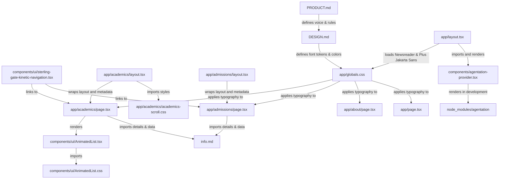

# Graph Report - Admissions & Academics Page Integration

This report documents the architectural structure, dependencies, and design systems of the Admissions page, Academics section, typography redesign, and layout refinements.

## File Relationship Graph

## Component and Route Descriptions

### 1. Route: `/academics`
*   **Layout** ([app/academics/layout.tsx](file:///c:/Users/phani/Desktop/College-Web-Redesign/app/academics/layout.tsx)): Contains page title and meta description metadata optimized for SEO. Imports `academics-scroll.css`.
*   **Syllabus Styles** ([app/academics/academics-scroll.css](file:///c:/Users/phani/Desktop/College-Web-Redesign/app/academics/academics-scroll.css)): Implements the responsive pinned mask reveal styling for desktop and mobile layouts.
*   **Page** ([app/academics/page.tsx](file:///c:/Users/phani/Desktop/College-Web-Redesign/app/academics/page.tsx)): Fully responsive layout featuring the five key academic sections:
    *   *Hero*: Intro banner featuring GSAP-powered line-reveal animations (`SplitType`), a background horizontal scroll parallax ticker, and dual criss-crossing infinite scrolling marquees (spanning full-screen width with solid black backdrops instead of glassmorphism) replacing the static description text.
    *   *Programs & Departments*: CME, ECE, EEE, and Basic Sciences sections integrated with a GSAP-pinned mask reveal parallax layout.
    *   *Syllabus & Calendar*: Cards styled with skeuomorphic depress effects, linking to syllabus downloads and calendar PDFs.
    *   *Examinations & Results*: Two-column overview of the Examination Cell and direct results portal redirection.
    *   *Academic Excellence*: Centered 25+ Years Legacy card launcher triggers the topper list explorer. The redundant featured topper card was removed.
    *   *Student Development*: Staggered tab animations showcasing clubs, workshops, guest lectures, and student achievements.

### 2. Component: `AnimatedList`
*   **Source** ([components/ui/AnimatedList.tsx](file:///c:/Users/phani/Desktop/College-Web-Redesign/components/ui/AnimatedList.tsx)): Translated React Bits scrolling selector with keyboard arrow-key navigation, in-view staggers, and selection callbacks. Fixed type error by changing `triggerOnce: false` to `once: false` inside the `useInView` hook.
*   **Styling** ([components/ui/AnimatedList.css](file:///c:/Users/phani/Desktop/College-Web-Redesign/components/ui/AnimatedList.css)): Dark-mode scrollbars, neon emerald list indicators, and selection animations.

### 3. Layout & Layout Polish Refinements
*   **About Page** ([app/about/page.tsx](file:///c:/Users/phani/Desktop/College-Web-Redesign/app/about/page.tsx)): Removed the "Institution Identity" and "Structural Integrity" badge pills to streamline layout.
*   **Home Page** ([app/page.tsx](file:///c:/Users/phani/Desktop/College-Web-Redesign/app/page.tsx)): Added an SBSP logo and branding header positioned at the top-left of the page viewport/hero section, balanced against the top-right header menu controls.
*   **Navigation & Branding Overlay** ([components/ui/sterling-gate-kinetic-navigation.tsx](file:///c:/Users/phani/Desktop/College-Web-Redesign/components/ui/sterling-gate-kinetic-navigation.tsx)): Refined menu opening animations. Fixed the brand section's visibility flash (FOUC) before starting the GSAP timeline by setting the initial hidden states of all animated items (`menu-brand-item`, `nav-link`, `menu-footer`) before opening the menu container's display. Wrapped the footer section and its top border (`border-t`) in an `overflow-hidden` container and animated it to slide up and reveal in sync with the menu links.
*   **Sticky Footer** ([components/ui/sticky-footer.tsx](file:///c:/Users/phani/Desktop/College-Web-Redesign/components/ui/sticky-footer.tsx)): Restructured campus links to balance page density. "Green Meadows Campus" spans 2 columns in a grid format, and Orchard Park & other campuses are consolidated, eliminating empty vertical columns on desktop viewports.
*   **Autoplay Testimonials** ([components/ui/circular-testimonials.tsx](file:///c:/Users/phani/Desktop/College-Web-Redesign/components/ui/circular-testimonials.tsx)): Configured an `IntersectionObserver` to pause auto-rotation until the testimonials section enters the viewport, ensuring that the Founder and Chairman slides are visible first upon scroll.
*   **Brand Nomenclature Cleanup**: Removed all legacy references to "Sri Vasavi" from global configs, system descriptors (`PRODUCT.md`, `DESIGN.md`), and main app layout headers (`app/layout.tsx`), replacing them strictly with "Smt. B. Seetha Polytechnic" (or "SBSP" in short form).

### 4. GSAP Percentage Preloader & Blinds Transition
*   **Global Effects** ([components/global-effects.tsx](file:///c:/Users/phani/Desktop/College-Web-Redesign/components/global-effects.tsx)): Replaced the deprecated Framer Motion preloader with a GSAP-driven loading timeline (0-100% percentage count and progress bar), vertical blinds reveal (5 panels on desktop, 3 on mobile), and a slide-up content entrance animation. Included session-storage persistence to prevent preloader execution on subsequent navigations. Initialized Lenis smooth scrolling globally under all routing conditions (including session bypasses) and synced its scroll ticks directly to GSAP's `ScrollTrigger.update()`.
*   **Global Styles** ([app/globals.css](file:///c:/Users/phani/Desktop/College-Web-Redesign/app/globals.css)): Appended standard Lenis utility styling selectors at the bottom of the style sheet for clean scroll behaviors.
*   **Loading Demo** ([app/loading-demo/page.tsx](file:///c:/Users/phani/Desktop/College-Web-Redesign/app/loading-demo/page.tsx)): Replaced with an interactive test-bed where the preloader session storage flag can be cleared and re-run.
*   **Housekeeping**: Deleted the deprecated `components/ui/kinetic-dots-loader.tsx` component.

### 5. Route: `/admissions`
*   **Layout** ([app/admissions/layout.tsx](file:///c:/Users/phani/Desktop/College-Web-Redesign/app/admissions/layout.tsx)): Configures route SEO title and description metadata.
*   **Page** ([app/admissions/page.tsx](file:///c:/Users/phani/Desktop/College-Web-Redesign/app/admissions/page.tsx)): Premium admissions route designed in alignment with SVES typography and color rules. Features:
    *   *Hero & trust badges*: Direct logos and AICTE validation callouts.
    *   *Scroll-Triggered Text Highlights*: Custom GSAP ScrollTrigger setup that fills background highlight colors on key phrases on scroll. Adjusted highlights to trigger a slower (2.2s) reveal speed with a premium yellow/amber theme.
    *   *Admission Overview*: Typographic sidebar layout outlining criteria, basis, and instruction language.
    *   *Academic Programs & Transition*: Brochure-style directory list for CME, ECE, EEE, coupled with a Year 1 -> Year 3 transition block connected by GSAP-animated dashed SVG arrows (`FlowArrow`).
    *   *GSAP Vertical Timeline*: Scroll-scrubbing progress line which fills as the user scrolls, highlighting active steps while retaining highlighted completed steps, with disabled animation fallback for `prefers-reduced-motion`.
    *   *Fees & Expandable Scholarships*: Consolidated fee receipt block, Government reimbursement callout, and clickable expanding scholarship lists (Pragati, Saksham, Swanath, Yashasvi, AP state schemes) with inline grid-start formatting.
    *   *Important Info Accordions*: Smooth height shifts for reservation, Aadhaar, and portal registrations.
    *   *Admissions Help Desk*: Clean contact information panel and direct action anchors.
    *   *Structural Bug Fix*: Corrected unbalanced `div` tags in the main content container wrapper to ensure successful Next.js build compilation.

### 6. Homepage Light Mode Redesign
*   **Theme System** ([app/globals.css](file:///c:/Users/phani/Desktop/College-Web-Redesign/app/globals.css)): Introduced a route-scoped `.light-theme` CSS class that overrides core CSS custom properties (`--color-primary`, `--color-dark`, `--color-overlay`, `--color-menu-bg`, `--color-border-soft`, `--color-muted`, `--color-arrow-bg`, `--color-footer-bg`, `--color-footer-text`, `--color-footer-muted`, `--color-footer-border`). Dark mode remains the default in `:root`; `.light-theme` sets pure white (`#ffffff`) background with soft charcoal (`#121214`) text. Added `.light-theme .nav-close-btn` overrides for dark glass-style button against white backgrounds.
*   **Route Detection** ([components/global-effects.tsx](file:///c:/Users/phani/Desktop/College-Web-Redesign/components/global-effects.tsx)): Uses `usePathname()` from `next/navigation` to detect the homepage (`/`). When on homepage: passes `lightMode={true}` to `<BackgroundGradientGlow />`, applies `.light-theme` class to the `page-content` wrapper, and adapts the preloader/blinds reveal backgrounds and text colors to white/charcoal.
*   **Background Gradient Glow** ([components/ui/background-gradient-glow.tsx](file:///c:/Users/phani/Desktop/College-Web-Redesign/components/ui/background-gradient-glow.tsx)): A dynamic full-screen component supporting both `corners` (Corner Whispers) and `diagonal` (Diagonal Flow) layout variants. Uses college colors (Growth Emerald, Academic Amber, Purple, and soft Yellow) with increased opacities (up to 55%) blended with an elegant multi-color base gradient flow.
*   **Background Demo** ([components/ui/demo.tsx](file:///c:/Users/phani/Desktop/College-Web-Redesign/components/ui/demo.tsx)): Interactive demo file importing and rendering the `BackgroundGradientGlow` component.
*   **Navigation** ([components/ui/sterling-gate-kinetic-navigation.tsx](file:///c:/Users/phani/Desktop/College-Web-Redesign/components/ui/sterling-gate-kinetic-navigation.tsx)): Removed hardcoded `color: 'white'` on the menu/close button text, replaced with `color: 'var(--color-dark)'` so text dynamically becomes charcoal on the light homepage and remains white on dark pages.
*   **Homepage** ([app/page.tsx](file:///c:/Users/phani/Desktop/College-Web-Redesign/app/page.tsx)): Removed the semi-opaque background panel overlay entirely (using `bg-transparent`), letting the colorful background gradient shine through 100%. Changed `text-white` on branding and section headings to `text-[var(--color-dark)]`. Softened the box-shadow for light backgrounds.
*   **Hero Components**:
    *   [components/ui/hero-subheading.tsx](file:///c:/Users/phani/Desktop/College-Web-Redesign/components/ui/hero-subheading.tsx): Changed `text-white/60` to `text-[var(--color-muted)]` and `text-white` to `text-[var(--color-dark)]`.
    *   [components/ui/morphing-cursor.tsx](file:///c:/Users/phani/Desktop/College-Web-Redesign/components/ui/morphing-cursor.tsx): Adapted base text from `text-white` to `text-[var(--color-dark)]`, hover circle from `bg-white` to `bg-[var(--color-dark)]`, and hover text from `text-black` to `text-[var(--color-primary)]` for proper theme inversion.
*   **Carousel** ([components/ui/framer-carousel.tsx](file:///c:/Users/phani/Desktop/College-Web-Redesign/components/ui/framer-carousel.tsx)): Replaced `border-white/10` with `border-[var(--color-border-soft)]`, `bg-zinc-950` with `bg-[var(--color-primary)]`, and progress dots from `bg-white` to `bg-[var(--color-dark)]`.
*   **Testimonials** ([components/circular-testimonials-demo.tsx](file:///c:/Users/phani/Desktop/College-Web-Redesign/components/circular-testimonials-demo.tsx)): Swapped all hardcoded color hex values in `CircularTestimonials` props to CSS variable strings (`var(--color-dark)`, `var(--color-muted)`, `var(--color-arrow-bg)`). Updated the subtitle text color and designation setup to resolve bad grey contrast in light mode.
*   **Events Gallery** ([components/events-gallery-demo.tsx](file:///c:/Users/phani/Desktop/College-Web-Redesign/components/events-gallery-demo.tsx)): Changed heading from `text-white` to `text-[var(--color-dark)]` and gallery font class from `text-white` to `text-[var(--color-dark)]`.
*   **Sticky Footer** ([components/ui/sticky-footer.tsx](file:///c:/Users/phani/Desktop/College-Web-Redesign/components/ui/sticky-footer.tsx)): Converted all hardcoded `bg-black`, `text-white`, `text-white/60`, `text-white/50`, `text-white/30`, `border-white/10` classes to CSS variable equivalents (`--color-footer-bg`, `--color-footer-text`, `--color-footer-muted`, `--color-footer-border`). On the homepage, the footer renders as white with dark text; on other pages, it remains black with white text.

### 7. Page Feedback & Visual Polish Fixes
*   **Kinetic Navigation** ([components/ui/sterling-gate-kinetic-navigation.tsx](file:///c:/Users/phani/Desktop/College-Web-Redesign/components/ui/sterling-gate-kinetic-navigation.tsx)): Changed the "Menu" and "Close" paragraphs' styles to use an explicit color value of `#000000` (black) instead of `var(--color-dark)`.
*   **Framer Carousel** ([components/ui/framer-carousel.tsx](file:///c:/Users/phani/Desktop/College-Web-Redesign/components/ui/framer-carousel.tsx)): Added a `text-white` class directly to the heading `h3` inside the carousel slides to prevent global tag styles (`h1, h2, h3 { color: var(--color-dark); }`) from overriding it to dark text on light-themed pages.
*   **Testimonial Subtitle** ([components/circular-testimonials-demo.tsx](file:///c:/Users/phani/Desktop/College-Web-Redesign/components/circular-testimonials-demo.tsx)): Changed the subtitle paragraph class from `text-[var(--color-muted)]` to `text-[var(--color-dark)] opacity-75` to provide higher contrast, better readability, and cohesive blending on the gradient backgrounds.
*   **Circular Testimonials Designation** ([components/ui/circular-testimonials.tsx](file:///c:/Users/phani/Desktop/College-Web-Redesign/components/ui/circular-testimonials.tsx) & [components/circular-testimonials-demo.tsx](file:///c:/Users/phani/Desktop/College-Web-Redesign/components/circular-testimonials-demo.tsx)): Updated the color mapping for the designation field from `var(--color-muted)` to `var(--color-dark)` and added an inline style with `opacity: 0.65` on the designation tag. This prevents a muddy flat-grey look and provides a clean, theme-aware text contrast.

